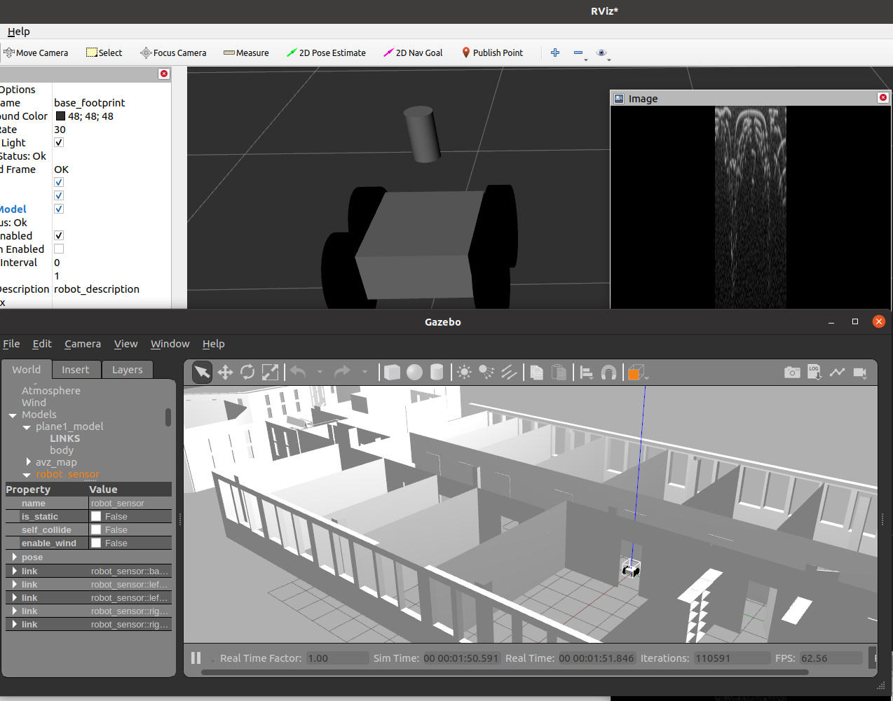

# radarays_gazebo_plugins

[radarays_ros](https://github.com/uos/radarays_ros) Gazebo plugin.

## Dependencies

- rmagine (embree / optix backend)
- rmagine_gazebo_plugins
- radarays_ros

## Raytracing acceleration structure - World file

For constructing and continuously updating the acceleration structure for ray tracing, add the following lines to your world files:

```xml
<sdf version="1.4">
<world name="default">

...

<!-- CPU: Embree Map Plugin -->
<plugin name='rmagine_embree_map' filename='librmagine_embree_map_gzplugin.so'>
  <update>
    <delta_trans>0.001</delta_trans>
    <delta_rot>0.001</delta_rot>
    <delta_scale>0.001</delta_scale>
    <rate_limit>200</rate_limit>
  </update>
</plugin>

<!-- Optix Map Plugin -->
<plugin name='rmagine_optix_map' filename='librmagine_optix_map_gzplugin.so'>
  <update>
    <delta_trans>0.001</delta_trans>
    <delta_rot>0.001</delta_rot>
    <delta_scale>0.001</delta_scale>
    <rate_limit>500</rate_limit>
  </update>
</plugin>

...

</world>
</sdf>
```

See [rmagine_gazebo_plugins](https://github.com/uos/rmagine_gazebo_plugins) for further explanations on that.

## Materials

You can assign so called `radarays_materials` to visuals of a model. An example is in `worlds/avz_collada.world`:

```xml
...
<model name="avz_map">
  <static>true</static>
  <link name="avz_map_link">
    <pose>0 0 0 0 0 0</pose>
    <visual name="avz_map_visual">
      <cast_shadows>false</cast_shadows>
      <geometry>
        <mesh>
            <uri>./avz_no_roof.stl</uri>
            <scale>1.0 1.0 1.0</scale>
        </mesh>
      </geometry>
      <radarays_material>
        <velocity>0.0</velocity>
        <ambient>1.0</ambient>
        <diffuse>0.0</diffuse>
        <specular>3000.0</specular>
      </radarays_material>
    </visual>
...
```

## Examples

Important files are:
- urdf/robot_radar_cpu.urdf -> URDF for a robot with a radar sensor simulated on CPU
- urdf/robot_radar_gpu.urdf -> URDF for a robot with a radar sensor simulated on GPU
- worlds/avz_collada.world -> Gazebo world-file that contains a mesh of an office with `radarays_materials` attached to it.

### example_robot.launch

Example for a robot that is spawned in a office-like environment, with `radarays_materials` attached to it. 

Run CPU version of radarays with Gazebo by calling

```console
roslaunch radarays_gazebo_plugins example_robot.launch rmagine:=embree
```

Run GPU version of radarays with Gazebo by calling

```console
roslaunch radarays_gazebo_plugins example_robot.launch rmagine:=optix
```




## Radar Parameters

You can change the radar parameters of the Gazebo simulation using dynamic reconfigure:

```console
rosrun rqt_reconfigure rqt_reconfigure
```

Note: We are using the same set of parameters (configuration file) we used for the experiments in `radarays_ros`:
- Some parameters are only used in the experiments but not in the Gazebo simulation
- For the sake of performance, the Gazebo plugin does not consider the robot's motion while simulating a polar image. (we will add this in the future)

## Known Issues
- At some point I got a segmentation fault when using rmagine's CPU simulators inside of the Gazebo threads. Unfortunately, I couldn't reproduce those errors.